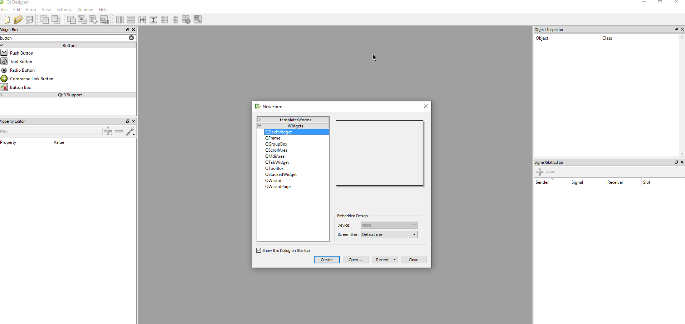
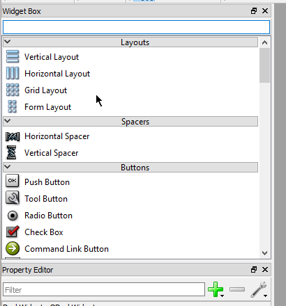
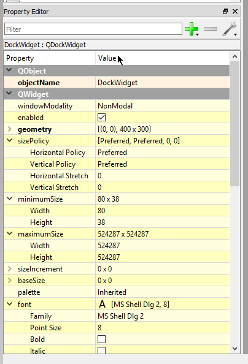
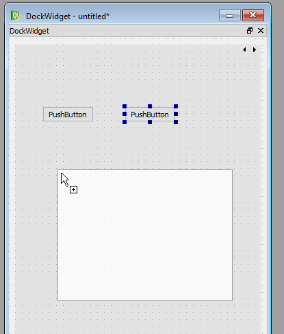
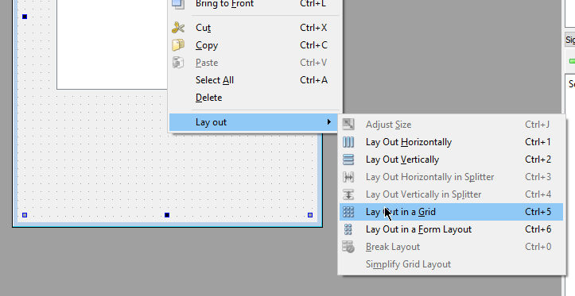
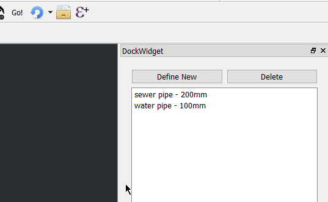

# Creating the UI and first logic

To create the UI you will need Qt Designer. This is shipped with QGIS and installed in the `bin` folder of the install.

Run the application called **designer.exe**

After we open designer we are going to select **Open..** and select `feature_template_dockwidget_base.ui`



Select and delete the label that is already in the dock widget.

Widgets



Properties



For our widget we are going to need a `Stacked Widget`.

- Drag the stack widget onto the form
- Right click in the empty form and select `Layout -> Layout in Grid`

All Qt widgets are contained in layouts.  The layout controls how the widgets fit together.

We can use the stacked widget to add move "pages" to our widget later if we connect the define new button.

You will also need 3x `Push Button` and a `List Widget`.  

Drag the buttons and list widget inside the stacked widget



Don't worry if they don't look right. When we set the layout it will fix them up for us



- Select a button and hit F2 to label the buttons. We need **Define new**, **Delete**, **Apply**
- Also update the object name on the buttons and list widget (`templatesList`, `newButton`, `deleteButton`, `applyButton`)
- Drag the widget around the form to change the layout

The name of the object is important because we will use this in the code to set more things.

- Save the UI file into your plugin working folder. Call it `ui_templatedock.ui`

## Generating the UI files

Qt has a handy function for creating the UI files on the fly.  This removes the build step for generating the UI files

Qt only needs the path to the `.ui` file and it will generate the Python object on the fly ready to use.

Open `feature_template_dockwidget.py`

```
FORM_CLASS, _ = uic.loadUiType(os.path.join(
    os.path.dirname(__file__), 'feature_template_dockwidget_base.ui'))
```

`uic.loadUiType` will load the UI on the fly from the `.ui` file without the need for the compile step.

## Adding some items to the list

Before we start on doing anything in QGIS itself.  Lets just add a few items to the list.  

It's going to be a hard-coded list for now but we can add config for it later.

Define it like this in the `feature_template_dockwidget.py` file

```
items = {
    "water pipe - 100mm":
        {
            "type": "water pipe",
            "size": 100
        },
    "sewer pipe - 200mm":
        {
            "type": "sewer pipe",
            "size": 200
        }
}
```

In the `FeatureTemplatesDockWidget` class we need to add new method to load the items

```
    def load_items(self):
        self.templatesList.clear()
        for key in items:
            self.templatesList.addItem(key)

```

in the `run` method of `feature_template.py` make sure you call `load_items`

```
    def run(self):
        ... 
        self.iface.addDockWidget(Qt.RightDockWidgetArea, self.dockwidget)
        self.dockwidget.show()
        self.dockwidget.load_items()
```

## Signals and Slots

Qt, and QGIS, uses Signals and Slots to message objects about events that have happened.  They are a great thing to use
when parts of your applications need to talk to each other.

Here is a quick run down.

- Objects can signals defined which are emitted when called
- Object can connect slots to these signals to handle the event
- Normal Python functions can be used for slots without any extra work

Here is an example:

```
def do_event(self):
    print "Do something"
    
mybuttton.pressed.connect(self.do_event)
```

### Connect the Update/Apply button

with that we are going to connect the apply button in our `FeatureTemplateDockWidget` object emit a signal to tell 
something else to handle the apply logic.

In `FeatureTemplateDockWidget` we need to define a signal called `templateApplied` like so

```
class FeatureTemplatesDockWidget(QtGui.QDockWidget, FORM_CLASS):

    templateApplied = pyqtSignal(str, dict)
    closingPlugin = pyqtSignal()
```

This signal will emit a string and a dictionary.

**Note**: Take note on where `templateApplied` is defined. Outside of any methods at the class level

Inside the `__init__` method we need to connect the apply button pressed event and handle the extra logic

```
    def __init__(self, parent=None):
        super(TemplateDock, self).__init__(parent)
        self.setupUi(self)
        self.applyButton.pressed.connect(self.apply_template)

    def apply_template(self):
        # Don't do anything if there is no selection text
        if not self.templatesList.currentItem():
            return

        name = self.templatesList.currentItem().text()
        
        # Get the fields from the items list
        fields = items[name]
        self.templateApplied.emit(name, fields)
```

We now need to connect to this signal in the `FeatureTemplates` class

```
    def initGui(self):
        self.dock = TemplateDock()
        self.dock.templateApplied.connect(self.apply_template)
        ....

    def apply_template(self, name, fields):
        pass
```

We will come back and wire up `apply_template` soon

Run `pb_tool deploy` again and restart QGIS or use the plugin reloader to test the plugin.  You should now see this:



# Lets move on using the [QGIS](qgis.md) API


