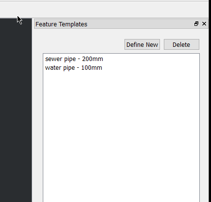

# Creating the UI and first logic

To create the UI you will need Qt Designer. This is shipped with QGIS and installed in the `bin` folder of the install.

Run the application called **designer.exe**


After we open designer we are going to select **QDockWidget** as we are going to make a dock inside QGIS.


On the sidebar we have the widgets list and properties.

Widgets


Properties


For our widget we are going to need a `Stacked Widget`.

- Drag the stack widget onto the form
- Right click in the emptry form and select `Layout -> Layout in Grid`

All Qt widgets are contained in layouts.  The layout controls how the widgets fit together.

You will also need 3x `Push Button` and a `List Widget`.  

Drag the buttons and list widget inside the stacked widget


Don't worry if they don't look right. When we set the layout it will fix them up for us


- Select a button and hit F2 to label the buttons. We need **Define new**, **Delete**, **Apply**
- Also update the object name on the buttons and list widget (`templatesList`, `newButton`, `deleteButton`, `applyButton`)
- Drag the widget around the form to change the layout

The name of the object is important because we will use this in the code to set more things.

- Save the UI file into your plugin working folder. Call it `ui_templatedock.ui`

## Compliing the UI

We need to edit the pb_tool.cfg to add the UI file we created. Open **pb_tool.cfg** and edit the `compiled_ui_files` section
to add the ui file we made

```
# Other ui files for your dialogs (these will be compiled)
compiled_ui_files: ui_templatedock.ui
```

Flick back to your **Console** that you opened where you ran `pb_tool`. 

- `pb_tool complie`

This will create a Python file based on the UI file that was created

```
F:\Workshop\QGIS-NZ\feature_templates>pb_tool compile
Compiling ui_templatedock.ui to ui_templatedock.py
Compiled 1 UI files
Skipping resources.qrc (unchanged)
Compiled 0 resource files
```

You can now see a `ui_templatedock.py` file that is in the main folder. We will use this file when we make the extra dock logic


## Creating the dock

Open `plugincore.py` and add the following below the import line

```
from ui_templatedock import Ui_DockWidget

class TemplateDock(Ui_DockWidget, QDockWidget):
    def __init__(self, parent=None):
        super(TemplateDock, self).__init__(parent)
        self.setupUi(self)
```

This class is used to control all the UI logic for the dock we have just made.

Before we go too far lets make sure our plugin can load and show this dock.

Edit `initGui` to look like the following:

```
    def initGui(self):
        self.dock = TemplateDock()
        self.iface.addDockWidget(Qt.RightDockWidgetArea, self.dock)
        self.dock.hide()
        
        ...
```

Edit `run` to add the dock

```
    def run(self):
        self.dock.show()
```

Also add the follow to the `unload` method

```
    self.iface.removeDockWidget(self.dock)
```

Open the command line and deploy you plugin using `pb_tool deploy`.

Restart QGIS or use the Plugin Reloader to reload your plugin

Hit the **Go!** button and the dock should open on the right hand side


## Adding some items to the list

Before we start on doing anything in QGIS itself.  Lets just add a few items to the list.  It's going to be a hard-coded list.

Define it like this

```
items = {
    "water pipe - 100mm":
        {
            "type": "water pipe",
            "size": 100
        },
    "sewer pipe - 200mm":
        {
            "type": "sewer pipe",
            "size": 200
        }
}

```

In the `TemplateDock` class we need to add new method to load the items

```
    def load_items(self):
        self.templatesList.clear()
        for key in items:
            self.templatesList.addItem(key)

```

in the `run` method make sure you call `load_items`

```
    def run(self):
        self.dock.load_items()
        self.dock.show()
```

## Signals and Slots

Qt, and QGIS, uses Signals and Slots to message objects about events that have happened.  They are a great thing to use
when parts of your applications need to talk to each other.

Here is a quick run down.

- Objects can signals defined which are emitted when called
- Object can connect slots to these signals to handle the event
- Normal Python functions can be used for slots without any extra work

Here is an example:

```
def do_event(self):
    print "Do something"
    
mybuttton.pressed.connect(self.do_event)
```

with that we are going to connect the apply button in our `TemplateDock` object emit a signal to tell something else to 
handle the apply logic.

In `TemplateDock` we need to define a signal called `templateApplied` like so

```
class TemplateDock(Ui_DockWidget, QDockWidget):
    templateApplied = pyqtSignal(str, dict)

    def __init__(self, parent=None):
```

This signal will emit a string and a dictionary.

**Note**: Take note on where `templateApplied` is defined. Outside of any methods at the class level

Inside the `__init__` method we need to connect the apply button pressed event and handle the extra logic

```
    def __init__(self, parent=None):
        super(TemplateDock, self).__init__(parent)
        self.setupUi(self)
        self.applyButton.pressed.connect(self.apply_template)

    def apply_template(self):
        # Don't do anything if there is no selection text
        if not self.templatesList.currentItem():
            return

        name = self.templatesList.currentItem().text()
        
        # Get the fields from the items list
        fields = items[name]
        self.templateApplied.emit(name, fields)
```

We now need to connect to this signal in the `PluginCore` class

```
    def initGui(self):
        self.dock = TemplateDock()
        self.dock.templateApplied.connect(self.apply_template)
        ....

    def apply_template(self, name, fields):
        pass
```

We will come back and wire up `apply_template` soon

Run `pb_tool deploy` again and restart QGIS or use the plugin reloader to test the plugin.  You should now see this:



# Lets move on using the [QGIS](qgis.md) API


