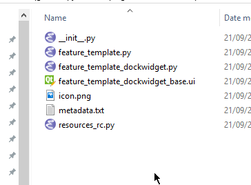
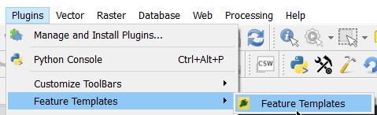

# Installing the plugin

A plugin is no good if it's not installed anywhere.  Plugins are installed in the `qgis2\python\plugins` folder but normally
it's a good idea to develop outside of that folder (this is your decision of course) and just deploy what is require into there.

You can copy the files in there manually however we have a tool (`pb_tool`) that can do it for us.

 - Run `OSGeo4W.bat` from the QGIS install folder
 - `cd FeatureTemplates`
 - `pb_tool deploy`
 
```
Deploying will:
                * Remove your currently deployed version
                * Compile the ui and resource files
                * Build the help docs
                * Copy everything to your .qgis2/python/plugins directory

Proceed? [y/N]: 
```
 
 Hit `y` and it will build and deploy the plugin.

 Leave this console open because we are going to come back to it
 
 This will create a publish metadata file and deploy it to `qgis2\python\plugins`. Open Windows Explorer to view the
 installed plugin. 
 


You will also notice that once deployed you don't have as many files.  Only the files that are needed at pushed the plugin
folder.



Fire up QGIS and you should be able to see the plugin in the plugin manager and installer.


Enable the plugin and select the new entry in the plugins menu.




If everything worked as expected we now have the plugin loaded and showing the empty dock panel on the right hand
side 

### PRO TIP!

Install the **Plugin Reloader** plugin in order to reload plugins without reloading QGIS.

# Now let's do something [cool](addingui.md)

