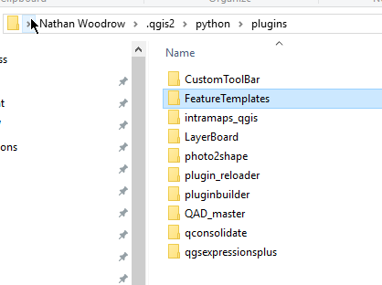
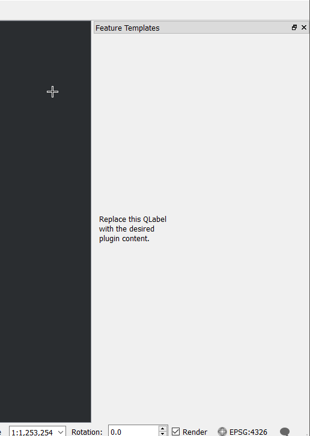

# Installing the plugin

A plugin is no good if it's not installed anywhere.  Plugins are installed in the `qgis2\python\plugins` folder but normally
it's a good idea to develop outside of that folder (totally up to you of course) and just deploy what is require into there

You can copy the files in there manually however we have a tool `pb_tool` that can do it for us.

 - Run `PyQGIS-Cmd.bat`
 - `cd feature_templates`
 - `pb_tool create`
 - `pb_tool deploy`
 
 Leave this console open because we are going to came back to it
 
 This will create a publish metadata file and deploy it to `qgis2\python\plugins`. Open Windows explorer to view the
 installed plugin. 
 

Fire up QGIS and you should be able to see the plugin in the plugin manager and installer

Enable the plugin and click the go button on the toolbar

If everything worked as expected we now have the plugin loaded and showing the message

### PRO TIP!

Install the **Plugin Reloader** plugin in order to reload plugins without reloading QGIS.

# Now lets do something [cool](addingui.md)

