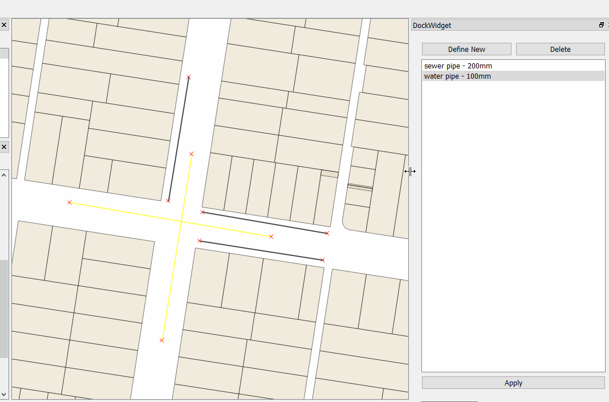

# Using the QGIS API

Now it's time to implement some QGIS based logic.

Goals:

- Handle apply button
- Handling layer selection
- Update features based on only set fields from config
- Refresh the map

First things first we need to handle the `apply_template` button from the last step in our `PluginCore` class.  In here we are going to grab the
selected objects and apply the field data we have in our template to the objects.

We can get the active layer object (make sure **pipes** is active) by doing:

```
layer = self.iface.activeLayer()
```

and we get the selected objects using:

```
features = layer.selectedFeatures()
```

putting it all together we have
 
```
    def apply_template(self, name, fields):
        layer = self.iface.activeLayer()
        features = layer.selectedFeatures()
        for feature in features:
            pass
```

now we want to apply the value from the `feilds` dictionary to the feature. Each `feature` will be of type `QgsFeature`

```
    for feature in features:
        for field, value in fields.itervalues():
            feature[field] = value
            layer.updateFeature(feature)
```

Loop over all the features and each field/value pair we have and update the values on the feature itself. 
We use `layer.updateFeature` to update the feature itself with the new values. QGIS doesn't update the values in the layer
until we do this.


`QgsFeature` objects can use Python index lookup to reference/assign a field and value. `feature[0]` will also work to 
get the value of the first field. 

Finally we need to update the map

```
self.iface.mapCanvas().refresh()
```

Here is the complete method:

```
    def apply_template(self, name, fields):
        layer = self.iface.activeLayer()
        features = layer.selectedFeatures()
        for feature in features:
            for field, value in fields.iteritems():
                feature[field] = value
                layer.updateFeature(feature)

        self.iface.mapCanvas().refresh()
```

Run `pb_deploy` and reload the plugin in QGIS.

## Load the sample project and test

Load the sample **workshop.qgs** qgis project found in the project folder for this workshop.  This project already has
some sample data we can work with. 

None of the data in the sample project has any type of sizes assigned.  We are now going to use the plugin to assign those
values. 

- Select some features using the select tool
- Enable editing in the toolbar
- Select a item from the list in the dock
- Hit apply

If everything is working you can see the new data being applied to the features on the fly. Win!



## PRO TIP

You can also try things in the QGIS Python Console to get an idea on how things will work and then using them in your
code here.
