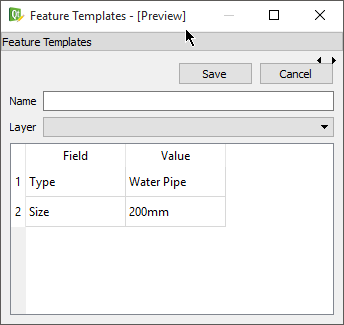
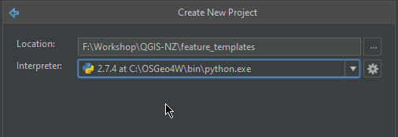
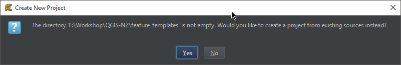

# Getting Started - Creating the base plugin

Most PyQGIS workshops normally start with using the QGIS plugin builder plugin, however we will not be using it in this workshop as it generates a lot of code and can be confusing when just starting.  It’s best to get an understanding of what each thing and how it works and fits together before using a template to save you time.  Once you understand the process template the heck out of it!
Workshop links:
Here are some links that we might use throughout the workshop or you can use later when building a plugin or working with the QGIS Python API.

- QGIS API: http://qgis.org/api/
- 2.8 http://qgis.org/api/2.8/
- QGIS cookbook: http://docs.qgis.org/testing/en/docs/pyqgis_developer_cookbook/

**Note:** We will be using 2.8 as the target install for PyQGIS however as the API is stable between 2.x version using 2.10 is also fine.

## Plugin goals

The goal of the workshop is to create a plugin but not just a “here is how to open a layer” type plugin, although they are handy,
 they don’t get you very far and the cookbook already covers that.
Let's build something that touches on different parts of the application, from symbols, layers, features, and even drag and drop if we get time.

The final goal of the plugin is to create something that can update QGIS features based on a pre defined templates.
The plugin will take the selected assets and update the values on the feature based on what is in the template.

Here is an example of the UI that we are going to build:





A bit ambitious for 3 hours? No doubt but we will give it a good crack.

## Creating the project

We are not going to start from nothing, that doesn’t really help us, so we are going to use a basic plugin setup to get 
up and running. 

This is only so we can get something started a more correct plugin, something that you can publish for others to 
use can need more work and polish.

- Copy the qgis-pluigin-template folder from the sample folder and make a new copy. Copy it into the same base folder
- Rename the plugin folder to **feature_templates**
- Open PyCharm and select File -> New Project (Create Project at the load screen)
- Select the folder you just created from the template project and set the Python version to the QGIS install



PyCharm will give you a warning about already having code in that. 




Say Yes to this as we want to create a PyCharm project from this lot of files

Once open in PyCharm we now have the basic code layout ready to go:


## Plugin layout explained

Before we get started it’s best to explain the basic layout of the simple plugin we have here


- `__init__.py` - The main entry point for this plugin that is called when QGIS loads the plugin
- `LICENSE` - Well I’m sure you can guess
- `metadata.txt` - The plugin metadata that is used when uploading the plugin to the plugin repository and when QGIS loads the plugin
- `plugincore.py` - The main code file for this plugin.  We will be adding a few more of these though out the workshop
- `README.md` - Notes on the plugin

Plugin layouts can different per project but will at a minimum contain these files

## Metadata

Open the metadata.txt file in PyCharm we are going to update it with some of the details of our plugin

```
[general]
name=feature_template
description=Feature template builder for DMS NZ workshop
about=Feature template builder for DMS NZ workshop
version=1.0
qgisMinimumVersion=2.8
author=Nathan Woodrow
email={your email}
icon=icon.png
changelog=
       0.1
       First version

homepage=
tracker=
repository=
```

`homepage`, `tracker`, `repository` are required fields if you will be uploading the plugin to the plugin repository
 however we will just leave them blank for now.  We might come back and fill them in later if we get time to upload them.
 
## `__init__` file and plugin entry point
 
Open up the `__init__` file.  The `__init__` file marks this folder as a Python package and QGIS can load a Python package
as a plugin if the package setup is right.

Inside `__init__` you will find

```
from plugincore import PluginCore


def classFactory(iface):
    """
    Main entry point for the QGIS plugin.  QGIS calls me and passes an instance of the interface object which
    can be used to talk to the main QGIS interface.
    :param iface: The API interface object used to talk to QGIS
    :return: A instance of the main class used by your plugin
    """
    return PluginCore(iface)

```

The `classFactory` method is called when QGIS loads the plugin. QGIS will pass the API interface object (`QgisInterface`)
into your plugin. This object is normally used to talk to the main QGIS UI interface.

The main thing this function does is return an instance of the class for you plugin (`PluginCore`).  `PluginCore` can be
found in `plugincore.py`

## PluginCore

Lets take a quick look at PluginCore before we do a test plugin install and then we will get into the good stuff.

```
class PluginCore:
    def __init__(self, iface):
        self.iface = iface

    def initGui(self):
        self.action = QAction("Go!", self.iface.mainWindow())
        self.action.triggered.connect(self.run)
        self.iface.addToolBarIcon(self.action)

    def unload(self):
        self.iface.removeToolBarIcon(self.action)
        del self.action

    def run(self):
        QMessageBox.information(None, "Minimal plugin", "Do something useful here")
``` 

The two main important methods here are `initGui` and `unload`. 

- `initGui` called when the plugin is loaded from QGIS.  Called when QGIS is loaded. We normally setup events, buttons, etc here
- `unload` called when the plugin is uploaded from the interface.  We do things that remove the plugin from the QGIS interface.

This basic plugin at this stage will simply create a toolbar icon called **Go!** and open a message box when pressed.

Lets move on to [deploying](deploy.md) the project to test this.


