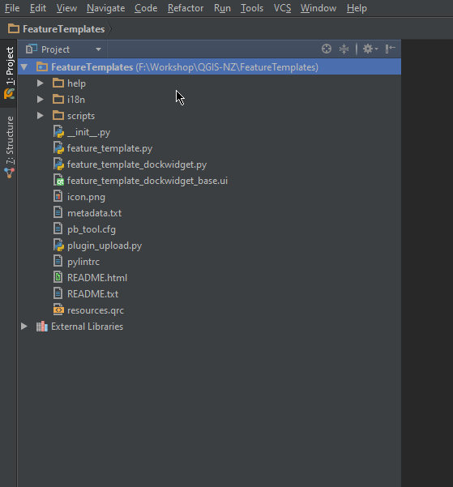

# Getting Started - Creating the base plugin

### Goals

- Generate a plugin using the QGIS plugin builder
- View plugin layout
- View plugin metadata
- View main plugin code

### Handy Links

Here are some links that we might use throughout the workshop or you can use later when building a plugin or working with the QGIS Python API.

- QGIS API: http://qgis.org/api/
- 2.8 http://qgis.org/api/2.8/
- QGIS cookbook: http://docs.qgis.org/testing/en/docs/pyqgis_developer_cookbook/

**Note:** We will be using 2.8 as the target install for PyQGIS however as the API is stable between 2.x version using 2.10 is also fine.

## Plugin goals

The goal of the workshop is to create a plugin but not just a “here is how to open a layer” type plugin, although they are handy,
 they don’t get you very far and the cookbook already covers that.
Let's build something that touches on different parts of the application, from symbols, layers, features, and even drag and drop if we get time.

The final goal of the plugin is to create something that can update QGIS features based on a pre defined templates.

Here is an example of the UI that we are going to build:


## Creating the plugin

We are not going to start from nothing, that doesn’t really help us, so we are going to use the QGIS plugin builder
to get up and running. 

This is only so we can get something started a more correct plugin, something that you can publish for others to 
use can need more work and polish.

### QGIS Plugin builder

For this we will need the QGIS plugin builder.  The QGIS plugin builder is a plugin you can install in QGIS that will
generate a plugin for you ready to go.

- Open QGIS and install the QGIS Plugin Builder Plugin
- From `Plugins -> Plugin Builder` run the plugin

The plugin builder will gives us a screen to fill in all the information that is needed.  Go ahead and fill in the in 
information as shown below:


Be sure to select **Tool button with dock widget** as the template


One should always add unit tests to our code but we won't here because well :P We are also using `pb_tool` so untick `Makefile`


If you want to publish the plugin for others it needs to have a bug tracker and code repository however we can put in stub
entries for those now as we don't need it yet and it's only enforced at publish time.


The next screen will ask you to select a folder to save the plugin into.  Save it into a know place for you. Doesn't matter
where just somewhere easy to get to.

### PyCharm project

We need to create a PyCharm project from the folder the plugin builder just generated for us.

- Open PyCharm and select `File -> Open` and select the folder that you just created using the plugin.  Should 



Open `File -> Settings` search for `Project` and set the **Project Interpertor** to the QGIS installed one.


**Note**: On Linux/OS X this is the default Python install no need to do anything here.

## Plugin layout break down

Before we get started it’s best to explain the basic layout of the simple plugin we have here


- `__init__.py` - The main entry point for this plugin that is called when QGIS loads the plugin
- `LICENSE` - Well I’m sure you can guess
- `metadata.txt` - The plugin metadata that is used when uploading the plugin to the plugin repository and when QGIS loads the plugin
- `feature_template.py` - The main code file for this plugin.  We will be adding a few more of these though out the workshop
- `README.txt` - The README for the plugin
- `pb_tool.cfg` - The `pb_tool` config file. Used to build and deploy the plugin
- `resoruces.qrc` - Qt resource file used to add icons to buttons and widgets.
- `feature_template_dockwidget_base.ui` - The base dock widget UI base file. We will open this in Qt Designer a bit later
- `feature_template_dockwidget.py` - Core logic for the `feature_template_dockwidget_base.ui`

There is also a scripts folder and help folder which we won't go into at this stage.

## Metadata

Open the metadata.txt file in PyCharm and have a look at the layout. This file contains all the information that used
by QGIS when it displays the plugin in the installer.

## `__init__` file and plugin entry point
 
Open up the `__init__` file.  The `__init__` file marks this folder as a Python package and QGIS can load a Python package
as a plugin if the package setup is right.

Inside `__init__` you will find

```
def classFactory(iface):
    """Load FeatureTemplates class from file FeatureTemplates.

    :param iface: A QGIS interface instance.
    :type iface: QgsInterface
    """
    #
    from .feature_template import FeatureTemplates
    return FeatureTemplates(iface)
```

The `classFactory` method is called when QGIS loads the plugin. QGIS will pass the API interface object (`QgisInterface`)
into your plugin. This object is normally used to talk to the main QGIS UI interface.

The main thing this function does is return an instance of the class for you plugin (`FeatureTemplates`).  `FeatureTempaltes` can be
found in `feature_template.py`

## PluginCore

Lets take a quick look at `feature_template.py` before we do a test plugin install.  There is a lot of stuff in this
template but we just need to have a quick look at a few methods

The two main important methods here are `initGui` and `unload`. 

- `initGui` called when the plugin is loaded from QGIS.  Called when QGIS is loaded. We normally setup events, buttons, etc here
- `unload` called when the plugin is uploaded from the interface.  We do things that remove the plugin from the QGIS interface.

# Important!

**Don't skip this step as the plugin will not load correctly**

Before we move on we need to update one thing the plugin builder doesn't generate correctly.  

Change the following line at the top from

```
import resources
```

to 

```
import resources_rc
```


# Lets move on to [deploying](deploy.md) the project to test this.


